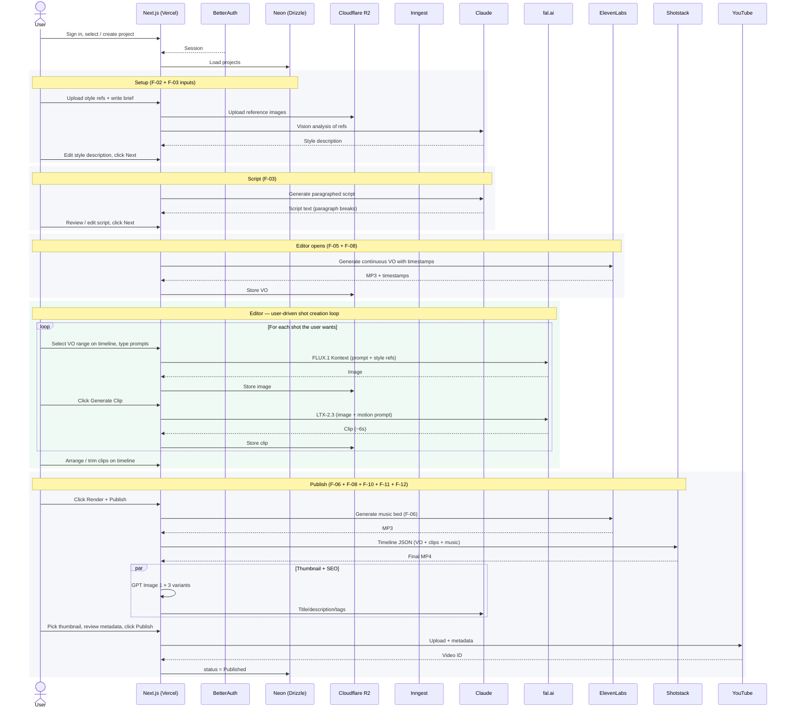

# AI Video Studio — Product Requirements Document

**Version:** 3.0 — Editor-First Pivot
**Date:** April 2026
**Status:** Active
**Phases:** 5 | **Features:** 15 (+ F-16 planned) | **Shipped:** F-01–F-05, F-07, F-08

> **✅ v4.0 IN PROGRESS — design approved 2026-06-13, Phase 2 shipped 2026-07-03.**
> This PRD describes the **v3.0 editor-first product** and remains accurate for
> parts of the code untouched by v4.0. The **Unified Directing Editor** —
> is being built in phases: **Phase 1 (beat-based VO) and Phase 2 (unified
> editor) are both shipped.** Batch generate (Phase 3) and the Reference
> Bible (Phase 4) are still planned. Authoritative docs:
> [`docs/superpowers/specs/2026-06-13-unified-directing-editor-design.md`](docs/superpowers/specs/2026-06-13-unified-directing-editor-design.md)
> (design spec) and
> [`docs/superpowers/plans/2026-06-13-v4-unified-editor-roadmap.md`](docs/superpowers/plans/2026-06-13-v4-unified-editor-roadmap.md)
> (phase roadmap). Headline changes — fold into this PRD as they land:
> - **Unified editor replaces the stepper — ✅ shipped 2026-07-03.** The
>   separate Script and Editor steps merged into one screen: inline-editable
>   script, two-layer beat/shot timeline, Timeline⇄Storyboard toggle. The
>   stepper is now Concept → Style → Editor. First-run setup (style + brief →
>   script) stays as a light guided path; script generation happens as the
>   editor's first-run gate.
> - **Beat-based VO** (F-05 evolution) — **✅ shipped.** The single continuous
>   voiceover has been replaced by per-beat audio; editing a beat's text
>   re-voices only that beat, and later beats ripple in time automatically.
>   The legacy continuous-VO columns and endpoints have been deleted.
> - **Reference Bible — "Cast & Locations" (new feature F-16).** 🔷 Still
>   planned (Phase 4). A per-project bible of recurring characters,
>   locations, and objects, each with a multi-view reference sheet that
>   conditions shot image generation for visual consistency. See
>   [`docs/feature16/feature.md`](docs/feature16/feature.md).
> - **Batch "Generate all"** 🔷 Still planned (Phase 3) — server-side
>   fan-out for images/clips with per-item status, replacing the
>   one-shot-at-a-time grind.

---

## Table of Contents

1. [Product Overview](#1-product-overview)
2. [End-to-End Flow](#2-end-to-end-flow)
3. [User Journey (screen-by-screen)](#3-user-journey-screen-by-screen)
4. [Build Sequence Overview](#4-build-sequence-overview)
5. [Phase 1 — Foundation](#5-phase-1--foundation)
6. [Phase 2 — Script & Voice](#6-phase-2--script--voice)
7. [Phase 3 — Editor](#7-phase-3--editor)
8. [Phase 4 — Asset Generation (on demand)](#8-phase-4--asset-generation-on-demand)
9. [Phase 5 — Assembly & Publishing](#9-phase-5--assembly--publishing)
10. [Phase 6 — Intelligence Layer](#10-phase-6--intelligence-layer)
11. [Non-Functional Requirements](#11-non-functional-requirements)
12. [Out of Scope (v1.0)](#12-out-of-scope-v10)
13. [Open Questions](#13-open-questions)
14. [Changelog from v2.0](#14-changelog-from-v20)

---

## 1. Product Overview

AI Video Studio is a web-based **AI-assisted video editor** for solo YouTube creators. The creator writes (or AI-generates) a script, produces a voiceover, then uses a timeline editor to place generated images and animated clips over the voiceover — one shot at a time — with AI helping on prompts and generation.

It is **not** a one-click "prompt → finished video" tool. That product category produces visibly AI-generated slop because the AI can't make taste decisions. AI Video Studio splits the work along the lines it's actually useful: **humans pick the beats, AI makes the pixels.**

### 1.1 Vision

One creator. One script. A timeline they control. Every shot generated the moment they drop it.

### 1.2 Target User

- Solo YouTube creators producing educational, explainer, or entertainment content (the "talking head replacement" niche)
- Creators who want production speed without sacrificing creative control
- Small media teams reducing per-video cost

### 1.3 Core Goals

- Reduce per-video active effort from 40+ hours to under 4 hours
- Let users produce videos in a distinct visual style via style-profile conditioning
- Commercially safe audio (ElevenLabs TTS + Music, zero Content ID risk)
- Publish to YouTube with AI-generated SEO metadata
- Ship the first usable editor in 3–6 weeks on a managed-API-only stack

### 1.4 Tech Stack Summary

Every row below is a managed API or a managed platform. No GPU self-hosting; no model training infra.

| Layer | Primary | Rationale |
|---|---|---|
| Frontend | Next.js on Vercel | Builder's existing stack |
| Auth | BetterAuth | Shipped in F-01 |
| ORM | Drizzle | Type-safe, lightweight |
| Database | Neon Postgres | Scale-to-zero, generous free tier |
| File storage | Cloudflare R2 | Free egress critical for video |
| Background jobs | Inngest | Durable workflows, native Next.js SDK |
| Script & metadata AI | Claude Sonnet 4.5 | Structured JSON tool use |
| Image generation | FLUX.1 Kontext via fal.ai | Style conditioning via reference images |
| Animation | LTX-2.3 image-to-video via fal.ai | ~$0.04/sec, 6s clips, LoRA-capable |
| Voiceover | ElevenLabs TTS (char-level timestamps) | Timestamps drive editor scrubbing |
| Music | ElevenLabs Music | Licensed data → zero Content ID risk |
| Assembly | Shotstack | JSON-timeline render |
| Thumbnails | GPT Image 1 | Reliable text overlay |
| Publishing | YouTube Data API v3 | — |

### 1.5 Estimated Cost Per 5-Minute Video

Costs in v3.0 are higher than v2.0 because the editor-first model encourages more shots per minute (user-paced, not AI-paced).

| Layer | Cost |
|---|---|
| Script (Claude, with web search) | ~$0.10 |
| Voiceover (~750 words / 5 min at ElevenLabs) | ~$1.00 |
| Images (~40 shots × FLUX.1 Kontext) | ~$1.60 |
| Animation (~40 shots × 6s at LTX-2.3) | ~$9.60 |
| Music (ElevenLabs Music, 5 min) | ~$0.75 |
| Assembly (Shotstack 1080p 5-min render) | ~$0.75 |
| Thumbnails (3 variants, GPT Image 1) | ~$0.25 |
| SEO metadata (Claude) | ~$0.05 |
| **Total per 5-min video** | **~$14** |

A 10-min video scales to ~$26–28.

### 1.6 Unit Economics Target

Retail $30–40 per 5-min video (or subscription with tiered included videos). ~2× margin at the variable-cost layer.

---

## 2. End-to-End Flow

The product is a **four-step linear flow** after login: Setup → Script → Editor → Publish. No more "Visuals" step — visuals live inside the Editor.



### 2.1 Narrative walkthrough

The creator signs in via BetterAuth and creates a project. Reference images go to R2, project metadata to Neon. They upload a style reference and write a brief. Claude analyses the style, they edit the description, click Next.

Claude generates the script as readable paragraphs. The user edits the text freely in a textarea (not a structured table — it's just prose). Click Next.

The **Editor** opens. First action in the editor: ElevenLabs generates **one continuous voiceover** for the whole script, with character-level timestamps. The VO appears as a waveform on the timeline. Nothing else is generated automatically.

The creator scrubs the waveform, selects a range (e.g. seconds 12–18), clicks "+ Shot", types or AI-suggests an image prompt and a motion prompt, and clicks Generate. An image appears, then a clip, and the clip lands on the timeline above the selected VO range. Repeat until the video is covered.

When they're ready, they click Render — Shotstack assembles the final MP4 from the VO + clips + music. The Publish screen shows thumbnails and SEO metadata (generated in parallel during render), they pick/edit, click Publish, and the video lands on YouTube.

---

## 3. User Journey (screen-by-screen)

Four steps after login: **Setup → Script → Editor → Publish**. Each step is one screen.

> **v4.0 note — ✅ shipped 2026-07-03.** This stepper journey has been
> reworked: it is now **Concept → Style → Editor → Publish**. Setup remains
> first-run setup (Concept + Style), but Script and Editor have collapsed
> into one **unified editor** — inline-editable script over a beat/shot
> timeline, a Storyboard view, and a static **Cast & Locations rail**
> placeholder on the left (the rail is live; the F-16 Reference Bible
> feature behind it is still Phase 4 — planned, not built). Publish is
> unchanged and still pending separately. The steps below describe the
> **v3.0 flow that has been replaced** — kept for historical reference; see
> [`docs/feature08/feature.md`](docs/feature08/feature.md) for the current
> editor and the design spec linked in the header for the full target flow.

### Step 0 — Dashboard *(F-01, shipped)*

Project list with status badges (Draft / Generating / Ready / Published) and **+ New project** button.

### Step 1 — Setup *(F-02 + F-03 inputs)*

One screen, three inputs:

- **Topic / brief** — free text
- **Style description** — auto-filled from reference images via Claude Vision, editable
- **Reference images** — drag-drop, 1–3 images

Optional: target duration (3/5/8/10 min), tone (educational/entertaining/documentary/satirical).

**On Next:** style profile saved, script generation kicks off in background.

### Step 2 — Script *(F-03)*

Generated script rendered as **editable prose** — a single textarea (with paragraph breaks). No scene structure. No per-paragraph metadata. Users edit freely like writing a document.

Controls:
- "Regenerate" — regenerates the whole script from the brief
- Edit in place (auto-save on blur)
- Word count + estimated duration (at 150 wpm) shown in header

**On Next:** move to the Editor. The Editor's first action is generating VO from the script.

### Step 3 — Editor *(F-05 + F-08 + F-04 + F-07, all surfaced here)*

The core of the product. A full-page timeline workspace.

**On open:** if VO doesn't exist for the current script, it's generated automatically (~30–60s wait shown as a progress indicator). If the script has changed since last VO, the user is prompted to regenerate.

**Layout:**
- Top bar: project name, style panel (editable), voice selector, Render button
- Main canvas: horizontal timeline
  - **VO track** (bottom) — waveform rendered from the VO MP3, scrubbable
  - **Clip track** (above) — user-placed clip blocks
  - **Playhead** — draggable, click-to-seek on the ruler
- Right panel (conditional):
  - When no clip selected: a "+ Shot" button (greyed until a VO range is selected)
  - When a shot is selected/being-edited: image prompt + motion prompt fields, AI-suggest button, image preview, clip preview, generate buttons

**Core interaction loop:**
1. User scrubs VO, drags to select a time range (or clicks a range from "smart suggestions" based on sentence boundaries)
2. Clicks **+ Shot**
3. Edits the shot's image prompt + motion prompt (or clicks "AI suggest" which uses Claude to infer prompts from the selected VO text)
4. Clicks **Generate image**. Preview appears in the side panel.
5. If happy, clicks **Generate clip**. Clip appears on the timeline at the selected range.
6. Drags clip to reposition, drags right edge to trim, click to edit prompts.
7. Repeat until satisfied.

**Playback:** Play button plays VO + any clip active at the playhead's position, muted-video + audio synced. Missing sections (no clip over the VO) show a placeholder + continue VO.

**Regeneration rules:**
- Edit a shot's image prompt → regenerate image and clip (clip depends on image)
- Edit only motion prompt → regenerate clip (image unchanged)
- Edit script text → prompt user: regenerate VO? (wipes current VO; shot timestamps may need re-alignment — tool offers "re-align shots to new VO" action)

### Step 4 — Publish *(F-06 + F-08 + F-10 + F-11 + F-12)*

Click **Render** on the Editor to move to Publish.

- **Render progress** — shown inline while Shotstack renders (~1–3 min for 5 min 1080p; background music F-06 generates in parallel and is mixed into the render).
- **Video preview** — final MP4 playing inline
- **3 thumbnail variants** (F-10), user picks or uploads own
- **Title x5** (F-12), user picks or writes
- **Description** with timestamps + CTA, editable
- **Tags** (F-12), editable chips
- **Visibility** — Public / Unlisted / Private / Scheduled
- **Publish** button

**On Publish:** Inngest uploads to YouTube, sets thumbnail + metadata, flips status to Published.

### Flow-to-feature map

| Step | Screen | Features surfaced |
|---|---|---|
| 0 | Dashboard | F-01 |
| 1 | Setup | F-02 (style) + F-03 (brief input) |
| 2 | Script | F-03 (script prose) |
| 3 | Editor | F-05 (VO) + F-08 (editor) + F-04 (image on demand) + F-07 (clip on demand) |
| 4 | Publish | F-06 (music) + F-08 (final render) + F-10 + F-11 + F-12 |

---

## 4. Build Sequence Overview

| Phase | Feature ID | Feature Name | Priority | Status |
|---|---|---|---|---|
| Phase 1 — Foundation | F-01 | Auth & Project Management | P0 | ✅ Shipped |
| | F-02 | Style Profile System | P0 | ✅ Shipped |
| Phase 2 — Script & Voice | F-03 | Script Generation | P0 | ✅ Shipped |
| | F-05 | Voiceover Generation | P0 | ✅ Shipped (v4.0 beat-VO Phase 1 + Phase 2 revoice-with-edit also shipped) |
| Phase 3 — Editor | F-08 | Timeline Editor / Unified Directing Editor | P0 | ✅ Shipped (v4.0 Phase 2 unified editor shipped 2026-07-03; final render pending) |
| Phase 4 — Asset Generation (on demand) | F-04 | Image Generation | P0 | ✅ Shipped |
| | F-07 | Animation & Video Clips | P0 | ✅ Shipped |
| Phase 5 — Assembly & Publishing | F-06 | Background Music | P0 | — |
| | F-09 | Auto-Subtitles & Captions | P1 | v1.1 |
| | F-10 | Thumbnail Generation | P0 | — |
| | F-11 | YouTube Publishing | P0 | — |
| | F-12 | SEO Metadata Generation | P0 | — |
| v4.0 — Unified Directing Editor | F-16 | Reference Bible (Cast & Locations) | P0 | 🔷 Planned (v4.0 roadmap Phase 4) |
| Phase 6 — Intelligence | F-13 | Research & Ideation Engine | P2 | v2.0 |
| | F-14 | Analytics Feedback Loop | P2 | v2.0 |
| | F-15 | Multi-Channel Management | P3 | v2.0 |

### 4.1 Iteration plan

v1.0 delivers a functioning editor-first creator loop. Bolded items ship first.

| Iteration | Ship |
|---|---|
| Done | **F-01** ✅, **F-02** ✅ |
| Iter 1 ✅ | **F-03** (simplified script, no scenes), **F-05** (continuous VO) |
| Iter 2 ✅ | **F-08** (timeline editor — waveform, shot CRUD, playback, no generation yet) |
| Iter 3 ✅ | **F-04** + **F-07** (image + clip generation wired into editor shots) |
| v4.0 (in progress) | Unified Directing Editor: beats + per-beat VO (Phase 1 ✅), unified editor UI (Phase 2 ✅ shipped 2026-07-03), batch generate (Phase 3, planned), **F-16 Reference Bible (Cast & Locations)** (Phase 4, planned) — see the v4.0 roadmap |
| Iter 4 | **F-06** (music), **F-08** final render via Shotstack |
| Iter 5 | **F-10** (thumbnails), **F-11** (publish), **F-12** (SEO), polish, deploy |
| v1.1 | F-09 captions, voice cloning (F-05), Style LoRA (F-02), AI-suggest prompts in F-08 |
| v2.0 | F-13, F-14, F-15 |

---

## 5. Phase 1 — Foundation

### F-01 — Auth & Project Management ✅ Shipped

BetterAuth (email + Google OAuth), project CRUD, soft-delete. Project rows in Neon via Drizzle, assets in R2 under `projects/{project_id}/`.

### F-02 — Style Profile System ✅ Shipped

Users upload 1–3 reference images. Claude Vision generates a style string. String + reference images feed every downstream image generation call (FLUX.1 Kontext accepts both). Templates let users save and reapply styles across projects.

---

## 6. Phase 2 — Script & Voice

### F-03 — Script Generation

**Priority:** P0
**Complexity:** Low (simplified from v2.0 — no shot structure)

**Description**
Claude generates a narrative script as prose with paragraph breaks for readability. No scene structure, no shot structure, no per-paragraph metadata. The entire script is one editable text field.

**User Stories**
- As a creator, I can enter a topic + target duration + tone, receive a full script
- As a creator, I can edit the script freely in a textarea — split paragraphs, add sentences, delete sections
- As a creator, I can regenerate the whole script from the same brief with one click
- As a creator, I see a live word count and estimated duration

**Acceptance Criteria**

*Generation*
- Input: `brief` (string), `targetDurationMinutes` (3/5/8/10), `tone` (educational/entertaining/documentary/satirical), `styleString` (optional)
- Output: single plain-text script with 3–8 paragraphs separated by blank lines
- Claude uses web search (2–4 queries) for factual grounding
- Hook is the opening ~30 seconds — dramatic, attention-grabbing

*Duration enforcement (two-pass)*
- Pass 1: Claude targets `targetMinutes × 150` words (150 wpm ElevenLabs narration average)
- After VO is generated, actual duration is measured from the ElevenLabs response
- If actual duration drifts >10% from target, the UI surfaces a "tighten/expand script" action that re-prompts Claude with the measured rate (e.g. "current pace is 140 wpm; to hit 5 min rewrite at 700 words")
- v1.0: surface the action; don't auto-trigger. User opts in.

*Editability*
- Edits persist to `project.script` on blur
- Word count + estimated duration update live (based on current text, at 150 wpm)

*Regeneration*
- "Regenerate script" replaces the current text and invalidates the VO (UI warns before regenerating)

**Data Model Changes**
- `projects.script` TEXT (was `scenes` table in v2.0 — dropped)
- `projects.brief`, `targetDuration`, `tone` — already exist
- Drop `scenes` table and `shots.sceneId` FK. Shots now FK directly to `projects.id`.

**Tech**
Claude Sonnet 4.5 via Anthropic API with web search and tool use; one structured string output.

---

### F-05 — Voiceover Generation

**Priority:** P0
**Complexity:** Low

**Description**
Generate a single continuous voiceover MP3 for the entire script. Character-level timestamps from ElevenLabs are stored and drive the editor's timeline (waveform rendering, playhead seeking, shot time-range selection).

**User Stories**
- As a creator, VO is generated for my whole script when I enter the Editor
- As a creator, I can pick from 6 preset voices (3 Female, 3 Male) with audio previews
- As a creator, I can change voice after VO exists — regenerates the whole VO
- As a creator, if I edit the script, the editor warns me that VO is stale
- **(v1.1)** Voice cloning + full ElevenLabs library

**Acceptance Criteria**
- Output: single MP3 + character-level timestamps JSON, stored in R2
- Generated when the Editor opens and no VO exists for the current script
- Voice selection: 6 preset voices hard-coded in config
- Changing voice regenerates VO (destructive — warns first; existing shot time ranges are re-aligned by proportional scaling based on old vs new duration)
- Combined VO duration shown as authoritative video length
- Rate-limit-friendly: one call per script (not per paragraph)

**Tech**
ElevenLabs TTS API; char-level timestamps; audio in R2 at `projects/{projectId}/voiceover.mp3`; Inngest step handles the single call with retry.

---

## 7. Phase 3 — Editor

### F-08 — Timeline Editor

**Priority:** P0 — The core of v3.0.
**Complexity:** High

**Description**
A full-page video editor. The VO is rendered as a waveform on a horizontal timeline; the user places shots on a track above the VO. Each shot is a user-defined time range paired with an image prompt, motion prompt, generated image, and generated clip. The editor supports arranging, trimming, regenerating, and previewing shots.

**User Stories**
- As a creator, I see my VO as a scrubbable waveform on arrival
- As a creator, I can click/drag on the waveform to select a time range and click "+ Shot" to create a shot
- As a creator, I can type or AI-suggest an image prompt + motion prompt, preview the generated image, and generate a clip
- As a creator, clips I generate appear on the track above the VO at the range I selected
- As a creator, I can drag clips to reposition, trim edges, click to edit prompts, and delete
- As a creator, I can press Play and hear the VO while the active clip plays over it, synced
- As a creator, I can click a shot to re-open its prompt panel and regenerate image or clip independently
- **(v1.1)** As a creator, I can split a clip into two at the playhead, or duplicate a clip

**Acceptance Criteria**

*Timeline rendering*
- VO waveform rendered using a library like wavesurfer.js
- Time ruler with click-to-seek
- Playhead draggable
- Pixels-per-second zoom control (fit-to-width as default)

*Shot creation*
- Drag-select a range on the VO track → Shot draft is created at that range in side panel (not yet committed to timeline)
- Side panel shows the VO text fragment for that range (extracted from char timestamps) as reference
- Image prompt + motion prompt text fields
- "AI suggest prompts" button → Claude generates both prompts from the VO fragment + project style string (<$0.01 per call)
- "Generate image" → FLUX.1 Kontext → preview in panel
- "Generate clip" → LTX-2.3 → clip lands on track at the shot's range
- Shot is committed to DB on first generation (image or clip)

*Shot editing*
- Click shot on track → prompt panel re-opens with current state
- Drag shot block to move it; drag right edge to trim; delete key to remove
- Regenerate image → also regenerates clip (dependency)
- Regenerate clip only → keeps image, regenerates clip

*Playback*
- Play from current playhead position
- Scene VO plays continuously; active clip renders in a synced video element
- When no clip covers the playhead, VO still plays, video element shows a placeholder

*Persistence*
- Shot position + trim changes save on drag-end
- Prompt edits save on blur
- Timeline state survives refresh

**Data Model**
```
shots (v3.0 shape)
  id UUID
  projectId UUID FK → projects.id (cascade)
  sortOrder INT
  startSeconds INT — shot's start on the global video timeline
  endSeconds INT — shot's end on the global video timeline
  text TEXT — cached VO fragment for reference (display only)
  imagePrompt TEXT
  motionPrompt TEXT
  imagePath TEXT, imageStatus enum
  clipPath TEXT, clipStatus enum, clipDurationSeconds INT
  createdAt, updatedAt
```
The `sceneId` FK is removed; shots attach directly to projects.

**APIs**
- `POST /api/projects/:id/shots` — create a shot (start, end, text, prompts). Returns the shot row.
- `PATCH /api/projects/:id/shots/:shotId` — update position / prompts / trim.
- `DELETE /api/projects/:id/shots/:shotId`
- `POST /api/projects/:id/shots/:shotId/image` — generate image for shot (server triggers F-04)
- `POST /api/projects/:id/shots/:shotId/clip` — generate clip for shot (server triggers F-07)
- `POST /api/projects/:id/shots/suggest-prompts` — Claude prompt suggestion for a VO fragment

**Tech**
Wavesurfer.js for waveform rendering; React state + server-backed CRUD for shots; polling or Inngest Realtime for generation status.

---

## 8. Phase 4 — Asset Generation (on demand)

### F-04 — Image Generation

**Priority:** P0
**Complexity:** Low-Medium (simplified from v2.0 — no batch fan-out)

**Description**
Generate one image for a single shot on user request. Called synchronously (well, async via Inngest/webhook) from the editor when the user clicks "Generate image" on a shot. Uses FLUX.1 Kontext when a Style Profile exists, Imagen 4 Fast when it doesn't.

**User Stories**
- Per F-08 shot creation loop — on-demand, per shot
- As a creator, I can upload my own image to replace a generated one for a shot

**Acceptance Criteria**
- Input: shotId (service resolves imagePrompt + styleString)
- FLUX.1 Kontext when `project.styleString` exists, passing the style reference images
- Imagen 4 Fast fallback when no style
- Output stored at `projects/{projectId}/shots/{shotId}/image.png` in R2
- Updates `shots.imagePath`, `imageStatus`
- User can upload replacement via file input
- User can request variants (v1.1)

**Tech**
FLUX.1 Kontext via fal.ai; Imagen 4 Fast fallback via Google AI Studio; async via Inngest step; cost tracking per project in Neon.

---

### F-07 — Animation & Video Clips

**Priority:** P0
**Complexity:** Low-Medium

**Description**
Animate one shot's image into a ~6s clip using LTX-2.3 image-to-video on fal.ai. Called on user request from the editor. LTX-2.3's default output is ~6s at 1080p/25fps; shot durations longer than that are handled in Shotstack assembly with Ken Burns fill on the tail.

**User Stories**
- Per F-08 shot creation loop
- As a creator, I can describe motion: "slow zoom in", "parallax pan"
- As a creator, I can regenerate the clip without regenerating the image
- **(v1.1)** LoRA URL attached automatically when the project's style profile has one

**Acceptance Criteria**
- Input: shotId (service resolves imagePath + motionPrompt)
- LTX-2.3 called via fal.ai with first-frame image + motion prompt
- Output stored at `projects/{projectId}/shots/{shotId}/clip.mp4`
- Updates `shots.clipPath`, `clipStatus`, `clipDurationSeconds`
- Async via Inngest; polls or webhook for completion
- Fallback if animation fails: image is treated as static slide; Shotstack applies Ken Burns on final render

**Tech**
LTX-2.3 via fal.ai; upload image to fal storage first (R2 presigned URLs sometimes fail); Inngest step for async.

---

## 9. Phase 5 — Assembly & Publishing

### F-06 — Background Music Generation

**Priority:** P0
**Complexity:** Low

**Description**
Generate a background music track using ElevenLabs Music (commercially cleared). Generated in parallel with the final render in Phase 4. The track is ducked under the VO during Shotstack assembly.

**User Stories**
- As a creator, I can pick a mood (Epic / Ambient / Playful) on the Publish screen and regenerate
- As a creator, I can upload my own royalty-free track
- As a creator, music ducks under my VO automatically

**Acceptance Criteria**
- Music generated at the total video duration (from VO length)
- 3 mood presets
- Volume ducking 10–50% of VO volume during speech (configurable slider)
- Upload-own MP3/WAV path
- Commercial licensing: ElevenLabs Music only. Suno and Udio excluded.

**Tech**
ElevenLabs Music API; audio mixing via Shotstack's duck filter on the server timeline.

---

### F-08 — Final Render (same feature, different phase)

The Timeline Editor feature F-08 covers both the editing UX and the final render. On the Publish screen:

- User clicks **Render**
- Server builds a Shotstack JSON timeline from `project.voiceoverPath` + all `shots[].clipPath` + music track
- Shotstack renders 1080p H.264 MP4
- Inngest step handles the 1–3 min wait (up to 15 min for 10-min videos)
- Final MP4 stored in R2 at `projects/{projectId}/final.mp4`

**Timeline JSON builder** responsibilities:
- VO as the audio track, full length
- Each shot as a video clip at its `startSeconds`, trimmed/looped to match shot duration
- Ken Burns fill on shots where the clip is shorter than the shot range
- Background music with duck filter during speech
- Simple cut transitions (crossfade/wipe optional in v1.1)

---

### F-09 — Auto-Subtitles & Captions

**Priority:** P1 — v1.1 (YouTube auto-captions as v1.0 stopgap)

Generate SRT from ElevenLabs character timestamps; optional Shotstack subtitle burn-in. Unchanged from v2.0 scope.

---

### F-10 — Thumbnail Generation

**Priority:** P0
**Complexity:** Low-Medium

Generate 3 thumbnail variants using GPT Image 1 on the Publish screen. Concept comes from Claude using the script + style string. User picks/regenerates/uploads-own. Unchanged from v2.0.

---

### F-11 — YouTube Publishing Integration

**Priority:** P0
**Complexity:** Medium

OAuth-backed upload to YouTube Data API v3. Resumable upload, scheduling, multi-channel support. Unchanged from v2.0.

---

### F-12 — SEO Metadata Generation

**Priority:** P0
**Complexity:** Low

Claude generates 5 title variants + description + tags + hashtags from the script. User edits before upload. Unchanged from v2.0.

---

## 10. Phase 6 — Intelligence Layer

Unchanged from v2.0 scope, deferred to v2.0 release.

- F-13 Research & Ideation Engine (vidIQ + Claude)
- F-14 Analytics Feedback Loop (YouTube Analytics API)
- F-15 Multi-Channel Management

---

## 11. Non-Functional Requirements

### Performance
- VO generation (5 min script): under 90 seconds
- Image generation: under 30 seconds per shot
- Animation generation: under 90 seconds per clip
- Final render (5 min 1080p): under 3 minutes
- Editor page load: under 2 seconds

### Cost Controls
- Per-shot cost estimate shown before Generate clicks
- Running project cost visible in editor header
- Monthly spend cap per user; hard stop at cap

### Storage
- All assets in R2; 90-day retention default
- Max project size: 5GB

### Security
- API keys server-side only
- YouTube OAuth tokens encrypted at application layer before write to Neon
- All DB queries scoped by `userId`; no cross-user asset access
- GDPR: cascade delete + R2 prefix sweep on account close

### Reliability
- All generation endpoints retry via Inngest (3 attempts, exponential backoff)
- Failed generations surface retry UI in the editor; user is never blocked
- Shotstack failures fall back to a Ken Burns + concat pipeline (same timeline data, simpler renderer)

### Compliance
- ElevenLabs Music only for AI-generated music (zero Content ID risk)
- Suno and Udio explicitly excluded
- AI disclosure label in YouTube description by default (editable)
- FLUX.1 Kontext and LTX-2.3 both carry commercial licences via fal.ai

---

## 12. Out of Scope (v1.0)

- Mobile app (web-only)
- Team / collaboration features
- In-app monetisation / Stripe (v1.1)
- Platforms other than YouTube (v2.0)
- Real-time collaborative editing
- Self-hosted inference for any model
- Split-clip, duplicate-clip, crossfade transitions (Editor polish, v1.1)
- AI-suggest prompts (v1.1 — editor ships with manual prompts first)

---

## 13. Open Questions

1. **Shot range selection UX.** Drag-to-select on the waveform vs. "auto-suggest shot boundaries at sentence endings + user toggles." Recommendation: both — drag is primary, sentence-boundary hints are a secondary affordance.

2. **VO regeneration on script edit.** Auto-regenerate on every save vs. require explicit "regenerate VO" action. Recommendation: explicit action, because VO regen invalidates shot time-ranges.

3. **Shot time-range alignment on VO regen.** If VO duration changes (e.g. voice swap from slow to fast voice), existing shots fall out of sync. Options: proportional scaling (simple, inaccurate for short shots), text-anchored re-mapping (find each shot's VO fragment in the new VO's timestamps), or force user re-alignment. Recommendation: proportional scaling in v1.0; text-anchored re-mapping in v1.1.

4. **Pricing model.** Subscription with included videos vs. per-video credits. Recommendation: subscription tiers with overage at cost + margin.

5. **Style LoRA gate.** LoRA training is $10/run; should it be paid-tier only? Recommendation: paid-tier only, 5 LoRAs/month cap on entry tier.

---

## 14. Changelog from v2.0

| Change | From (v2.0) | To (v3.0) | Why |
|---|---|---|---|
| Core architecture | Autonomous "prompt → video" pipeline | Editor-first, user-driven shot placement | AI-picked shot boundaries don't match narrative beats; users want creative control |
| User journey | 5 steps (Setup → Script → Visuals → Editor → Publish) | 4 steps (Setup → Script → Editor → Publish) | "Visuals" step collapsed into Editor |
| Scenes data model | scenes table with per-scene VO, shots nested under scenes | Scenes dropped entirely; shots attach directly to projects | Scenes were a crutch for autonomous generation; editor-first model doesn't need them |
| Script output | Structured JSON with scenes + shots | Plain-text prose with paragraph breaks | Prose is more editable; shot structure is user-defined in editor now |
| Voiceover (F-05) | One VO per scene, chained | One continuous VO for whole script | Editor needs a single waveform; whole-script VO is simpler and has consistent pacing |
| Shot generation (F-04, F-07) | Batch fan-out when entering Visuals step | On-demand when user creates a shot in editor | No wasted generations; user sees and approves each shot before paying for it |
| F-08 | "Video Assembly & Timeline" (backend-only) | "Timeline Editor" (user-facing UI) + final render | Editor IS the product's main surface |
| F-03 complexity | Medium (shot structure in Claude output, validator, repair logic) | Low (plain text) | Drop the whole shot-validation apparatus |
| Cost per 5-min video | ~$7 (v2.0 projected) | ~$14 (v3.0 actual) | Users place more shots when they control pacing; this is a feature not a bug, but it doubles variable cost |
| Iter 1 ship target | F-02, F-03 | F-03 (simplified), F-05 (continuous) | Foundation already shipped (F-01, F-02); skip directly to the pivot's critical path |
