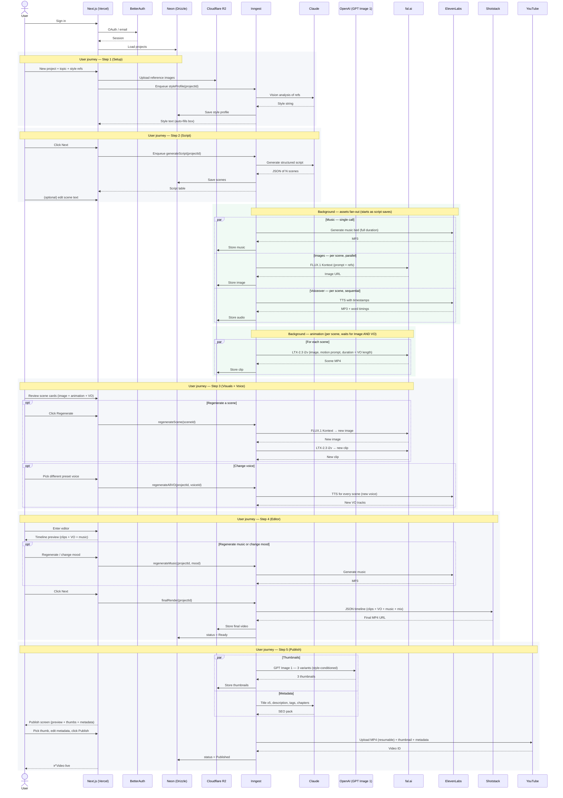

# AI Video Studio — Product Requirements Document

**Version:** 2.0 — Managed Stack Pivot
**Date:** April 2026
**Status:** Active
**Phases:** 5 | **Features:** 15 | **Shipped:** F-01

---

## Table of Contents

1. [Product Overview](#1-product-overview)
2. [End-to-End Flow](#2-end-to-end-flow)
3. [User Journey (screen-by-screen)](#3-user-journey-screen-by-screen)
4. [Build Sequence Overview](#4-build-sequence-overview)
5. [Phase 1 — Foundation](#5-phase-1--foundation)
6. [Phase 2 — Asset Generation](#6-phase-2--asset-generation)
7. [Phase 3 — Video Production](#7-phase-3--video-production)
8. [Phase 4 — Publishing Layer](#8-phase-4--publishing-layer)
9. [Phase 5 — Intelligence Layer](#9-phase-5--intelligence-layer)
10. [Non-Functional Requirements](#10-non-functional-requirements)
11. [Out of Scope (v1.0)](#11-out-of-scope-v10)
12. [Open Questions](#12-open-questions)
13. [Changelog from v1.0](#13-changelog-from-v10)

---

## 1. Product Overview

AI Video Studio is a web application that lets a solo creator produce high-quality, anonymous YouTube videos — in the style of Kurzgesagt or any custom visual identity — using a fully AI-powered pipeline. The user defines a style, writes or generates a script, and the app orchestrates every production step through managed APIs, delivering a ready-to-publish video and YouTube metadata with minimal manual effort.

### 1.1 Vision

One creator. One prompt. One published video. No camera, no face, no studio.

### 1.2 Target User

- Solo content creators building anonymous educational or entertainment YouTube channels
- Creators running multiple channels with distinct visual identities
- Small media teams looking to reduce production cost and time

### 1.3 Core Goals

- Reduce per-video production time from 40+ hours to under 2 hours of active effort
- Allow complete visual style switching between videos via 1–3 reference image uploads
- Generate commercially safe audio (voiceover + music) with zero Content ID risk
- Publish directly to YouTube with AI-generated SEO metadata
- Ship in 2–4 weeks as a solo builder on a managed-API-only stack — no self-hosted GPUs, no trained-model ops, no infra babysitting

### 1.4 Tech Stack Summary

Every row below is a managed API or a managed platform. No GPU self-hosting; no model training infra; no queue infra to own.

| Layer | Primary | Alternatives | Rationale |
|---|---|---|---|
| Frontend | Next.js on Vercel | Cloudflare Pages | Already the builder's stack |
| Auth | BetterAuth | Clerk | Already shipped with F-01; self-owned sessions, no per-MAU cost |
| ORM | Drizzle | Prisma | Type-safe queries; lightweight; already in use |
| Database | Neon Postgres | Supabase Postgres | Scale-to-zero serverless; generous free tier; branching for dev envs |
| File storage | Cloudflare R2 | Supabase Storage | Free egress is critical for video |
| Background jobs | Inngest | Trigger.dev | 2-hour step timeout fits Shotstack renders; native Next.js SDK |
| Script & metadata AI | Claude Sonnet 4.6 | GPT-5.4, Gemini 3.1 Pro | Structured JSON out-of-box |
| Image generation (style) | FLUX.1 Kontext via fal.ai | GPT Image 1.5 | Image + text input; 3 reference images for style conditioning |
| Image generation (no style) | Imagen 4 Fast via Google AI Studio | — | Cheap text-only fallback |
| Animation | **LTX-2.3 via fal.ai** | Kling 2.6, Runway Gen-4 Turbo | Managed LTX, LoRA-capable, ~$0.04/sec at 720p |
| Style LoRA (optional, v1.1) | **fal.ai LTX-2 Video Trainer** | — | Managed trainer; no RunPod, no .safetensors ops |
| Voiceover | ElevenLabs TTS (word-level timestamps) | PlayHT | Best-in-class; timestamps feed captions for free |
| Music | ElevenLabs Music | AIVA | Licensed training data → zero Content ID risk |
| Captions | ElevenLabs STT timestamps (reused from TTS) | Whisper API | Already captured in F-05 |
| Assembly | Shotstack | Creatomate, FFmpeg | JSON-timeline render; managed |
| Thumbnails | GPT Image 1 | Ideogram | Reliable text overlay |
| Publishing | YouTube Data API v3 | — | — |
| Research & SEO | Claude (v1); vidIQ API (v1.1) | Perplexity | Start simple |
| Analytics | YouTube Analytics API | — | — |
| Payments | Stripe | — | Wire in when monetising |

### 1.5 Estimated Cost Per 10-Minute Video

| Layer | Estimated Cost |
|---|---|
| Script (Claude) | ~$0.10 |
| Images (FLUX.1 Kontext, ~20 scenes) | ~$0.80 |
| Animation (LTX-2.3 at 720p, ~150 sec) | ~$6.00 |
| Voiceover (ElevenLabs, ~9k chars) | ~$2.00 |
| Music (ElevenLabs Music, 1 track) | ~$1.50 |
| Captions | $0 (reused from TTS) |
| Assembly (Shotstack) | ~$1.50 |
| Thumbnails (GPT Image 1, 3 variants) | ~$0.25 |
| SEO metadata (Claude) | ~$0.05 |
| YouTube upload | $0 |
| **Total per video** | **~$12–14** |

Infra floor: ~$25–45/month at MVP scale (Neon free tier → ~$19 Launch plan once projects grow, Inngest free tier → $20/mo once you exceed 50k runs, R2 ~$5, BetterAuth free, Vercel free). Scales near-linearly with video volume because the dominant costs are per-generation API calls.

### 1.6 Scale at a glance

| Stage | Videos/mo | Variable spend | + Infra | Total |
|---|---|---|---|---|
| Pre-launch demo | 10 | ~$130 | $25 | ~$155 |
| 5 paying users × 4 videos | 20 | ~$260 | $35 | ~$295 |
| 20 paying users × 4 videos | 80 | ~$1,050 | $45 | ~$1,095 |

At $25–30/video pricing, margin is ~2×.

---

## 2. End-to-End Flow

The pipeline is a progressive chain of durable Inngest workflows, one group per step in the user journey. Each forward click ("Next") enqueues the next group of jobs — there is no single "Generate Video" click. Each box below is a separate Inngest step: if any one fails, only that step retries, and the user is never blocked by a single failure.

### 2.1 Narrative walkthrough

The user signs in via BetterAuth and creates a project. Reference images land in R2, project metadata in Neon (accessed through Drizzle). Each forward step in the user journey enqueues Inngest work that runs in the background while the user continues navigating — there is no single "Generate Video" click; the pipeline is progressive.

The workflow is organised as user-journey groups of Inngest steps, one group per screen (see Section 3). Inngest owns retry, state, and observability for each step — if the fal.ai animation step fails on scene 7, that scene retries; the other scenes stay intact. The user sees per-step progress in the UI via Inngest Realtime (or server-sent events from a Next.js API route that reads `generations.status` from Neon — either works; pick whichever is simpler on the day).

Everything that can run in parallel does. As soon as the script is finalised on Step 2, three parallel fan-outs start: image generation across scenes, voiceover across scenes (sequential internally due to ElevenLabs rate limits but under a minute per scene), and music on the full script. Each animation (LTX-2.3 image-to-video) fires as soon as its scene's image **and** voiceover are both ready — VO drives clip duration. The user first hears voiceover on the Visuals + Voice screen (Step 3), not on the final editor. The single slow step is Shotstack final assembly, which can take 10–15 minutes for a 10-minute 1080p render and is kicked off when the user clicks Next out of Step 4.

Publish-layer assets (thumbnails F-10 and SEO metadata F-12) also generate in parallel in the background — triggered when the user clicks Next out of the Editor — so Step 5 Publish opens with variants already rendered. The user reviews the final video, picks a thumbnail, edits metadata if desired, then clicks **Publish** to push to YouTube. The same workflow can schedule instead of publishing immediately.

---

## 3. User Journey (screen-by-screen)

The product is a **five-step linear flow** after login: **Setup → Script → Visuals → Editor → Publish**. Each step is one screen. The user moves forward with **Next**; they can return to earlier steps via a progress header, but data generated in later steps may be invalidated and regenerated if upstream inputs change.

The backend workflow (Section 2) runs continuously in the background: work for later steps begins as soon as the data it depends on is available, not when the user clicks into that step. By the time the user finishes the Script screen, image + voiceover + animation jobs are already running. The goal is that each "Next" click feels almost instant because the assets are largely or fully ready.

### Step 0 — Dashboard *(F-01, shipped)*

Standard project list with status badges (Draft / Generating / Ready / Published) and a **+ New project** button that takes the user to Step 1.

### Step 1 — Setup *(F-02 + F-03 inputs)*

One screen, three inputs:

- **Topic / description** — free text. "What is this video about?"
- **Style description** — text box, **auto-filled from the reference images** via Claude Vision once the user uploads them. User can edit the suggested text before continuing.
- **Reference images** — drag-drop uploader for 1–3 images (JPEG/PNG/WebP, 10MB each).

Optional in v1.0: a **target duration** selector (3 / 5 / 8 / 10 minutes) and a **tone** selector (educational / entertaining / documentary / satirical). These feed F-03.

**On Next:** style profile saved to Neon and R2; script generation kicks off immediately in the background (F-03); user lands on Step 2 within seconds as the first scenes stream in.

### Step 2 — Script *(F-03)*

AI-generated script rendered as an editable table, one row per scene:

| # | Voiceover line | Scene description | Image prompt | Duration |
|---|---|---|---|---|

The user can:

- Edit any cell inline (voiceover, scene description, image prompt)
- Regenerate a single scene ("✨ Regenerate row") — preserves other rows
- Re-order scenes by drag
- Add or delete scenes
- See the running total duration vs. target, with a warning if drift exceeds 15%

**Behind the scenes on Next:** for every finalised scene, three jobs start **in parallel** — image generation (F-04), voiceover generation (F-05), and a music job on the full script (F-06). Animation (F-07) waits for the image and then fires automatically. This parallelism is why the user never waits on a single long queue.

### Step 3 — Visuals + Voice *(F-04 + F-05 + F-07, shown together per scene)*

Grid view, one card per scene. Each card shows:

- The generated still image (F-04)
- The animated clip playing on hover, **with the scene's voiceover audio** (F-05 + F-07). Clicking a scene plays it as a complete audio+visual unit — the user can judge whether the scene "works" in one view.
- A caption with the scene description
- A **Regenerate scene** button — regenerates **both image and animation** in one click (VO only regenerates if the script text for that scene changed)
- An **Edit description** button — opens a mini-editor; on save, regenerates image + animation for that scene
- An **Upload your own** override — replaces the image with a user file

Two persistent side panels:

- **Style panel (right)** — style description text + reference image thumbnails, always editable. If the user edits the style, scenes show an "out of date" marker until regenerated.
- **Voice panel (right, below Style)** — gender toggle (Female / Male) + 2–3 preset voice cards per gender with audio previews. Changing the voice regenerates all scene voiceovers at once and updates the scene cards in place. Voice cloning and the full ElevenLabs voice library are deferred to v1.1; 6 preset voices is enough for MVP.

**What the user doesn't see but is running:** music generation (F-06) is completing in the background while the user reviews visuals + voice. By the time they click Next, the music bed is usually ready.

### Step 4 — Editor *(F-06 + F-08)*

Simplified video editor with a horizontal timeline showing scene clips (with their locked-in voiceover from Step 3) and the music track. First time the user sees everything assembled together.

Controls in v1.0:

- **Music** — current AI-suggested track with play/pause; **Regenerate** button (new generation with same mood); **Change mood** preset selector (Epic / Ambient / Playful); **Upload your own** override.
- **Mix** — one slider for music volume during speech (ducking level, 10–50%).
- **Transitions** — default is cut; optional crossfade/wipe toggle (global).
- **Preview** — plays the assembled video inline using a draft Shotstack render.

**On Next:** final 1080p Shotstack render is triggered; the user moves to Step 5 and the final MP4 finishes rendering by the time they've reviewed metadata.

### Step 5 — Publish *(F-10 + F-11 + F-12)*

Everything needed to ship to YouTube on one screen:

- **Video preview** (final render)
- **3 AI-generated thumbnail variants** (F-10); user picks one, can regenerate individual variants, or upload their own
- **Title** — 5 AI-ranked variants (F-12); user picks or writes their own
- **Description** — pre-filled with hook + chapter timestamps + CTA template; editable
- **Tags** — 15–20 AI-generated tags; editable chips
- **Channel picker** (v1.0: single channel; v1.1 multi-channel)
- **Visibility** — Public / Unlisted / Private / Scheduled
- **Publish** button (or **Schedule**)

**On Publish:** Inngest step uploads the MP4 via YouTube Data API v3 (resumable), sets the thumbnail, writes metadata, and flips the project status to **Published**. User sees a success screen with the YouTube URL.

### Flow-to-feature map

| Step | Screen | Features surfaced | Runs in background |
|---|---|---|---|
| 0 | Dashboard | F-01 | — |
| 1 | Setup | F-02 (style) + F-03 (topic input) | Claude Vision analyses refs |
| 2 | Script | F-03 (script table) | Images + VO + Music start as soon as scenes finalise |
| 3 | Visuals + Voice | F-04 + F-05 + F-07 (per scene) | Music completes in parallel |
| 4 | Editor | F-06 + F-08 (assembly) | Final 1080p render queues on Next |
| 5 | Publish | F-10 + F-11 + F-12 | Upload to YouTube |

### Regeneration rules (important edge cases)

When a user returns to an earlier step and edits something, downstream work invalidates. The rules:

- **Style change in Step 1 or 3** → invalidates images and animations for all scenes (VO unaffected, music unaffected).
- **Script text change in Step 2** for a row → invalidates image + animation + VO for that row only.
- **Voice change in Step 3** → regenerates all VO; images and animations unaffected; music unaffected.
- **Music change in Step 4** → regenerates music + re-triggers final assembly.

Invalidations show as visual "stale" badges on the affected assets; the user clicks **Regenerate affected scenes** to resolve, or the next forward click does it automatically.

---

## 4. Build Sequence Overview

Features are ordered to deliver a usable product as early as possible. Each phase produces a working, demonstrable output before the next begins.

- **Phase 1** → functional script + style tool (F-01 shipped; F-02 and F-03 next)
- **Phase 2** → all raw assets generated (images, voice, music)
- **Phase 3** → assembled video file ready for review
- **Phase 4** → end-to-end: prompt in, YouTube video out
- **Phase 5** → self-improving growth engine

| Phase | Feature ID | Feature Name | Priority | Status |
|---|---|---|---|---|
| Phase 1 — Foundation | F-01 | Auth & Project Management | P0 | ✅ Shipped |
| | F-02 | Style Profile System | P0 | ▶ Next |
| | F-03 | Script Generation | P0 | ▶ Next |
| Phase 2 — Asset Generation | F-04 | Image Generation | P0 | — |
| | F-05 | Voiceover Generation | P0 | — |
| | F-06 | Background Music Generation | P0 | — |
| Phase 3 — Video Production | F-07 | Animation & Video Clips | P0 | — |
| | F-08 | Video Assembly & Timeline | P0 | — |
| | F-09 | Auto-Subtitles & Captions | P1 | — |
| Phase 4 — Publishing Layer | F-10 | Thumbnail Generation | P0 | — |
| | F-11 | YouTube Publishing Integration | P0 | — |
| | F-12 | SEO Metadata Generation | P0 | — |
| Phase 5 — Intelligence Layer | F-13 | Research & Ideation Engine | P2 | — |
| | F-14 | Analytics Feedback Loop | P2 | — |
| | F-15 | Multi-Channel Management | P3 | — |

### 4.1 Four-week MVP cut

To ship the shortest usable loop in 2–4 weeks, v1.0 includes only the bolded features below. Everything else becomes v1.1 or v2.0.

| Week | Ship |
|---|---|
| Done | F-01 ✅ |
| Week 1 | **F-02** (style profile — AI-suggested style text + refs, no LoRA), **F-03** (script) |
| Week 2 | **F-04** (images), **F-05** (voiceover with 6 preset voices), **F-07** (animation) |
| Week 3 | **F-06** (music), **F-08** (assembly with mix slider) |
| Week 4 | **F-10** (thumbnails), **F-11** (YouTube publish), **F-12** (Claude-only SEO metadata), polish, deploy |
| v1.1 | F-09 captions, vidIQ in F-12, voice cloning + full library in F-05, Style LoRA training in F-02 |
| v2.0 | F-13, F-14, F-15 |

F-06, F-10, and F-12 were originally marked for v1.1 but the user-journey restructure surfaces them on Step 4 and Step 5 — cutting them would leave visible gaps in the flow. They're in-scope for v1.0 with their simplest implementations and promoted to P0 accordingly. F-09 (captions) remains P1 / v1.1 because YouTube's own auto-captions are a viable v1 stopgap.

---

## 5. Phase 1 — Foundation

### F-01 — Auth & Project Management ✅ Shipped

**Status:** Complete in production. No further work required for v1.0.

For reference, this feature delivered: BetterAuth (email + Google OAuth), project CRUD, project list with status badges (Draft / Generating / Ready / Published), and soft-delete with 30-day recovery. Project rows live in Neon, accessed via Drizzle ORM, keyed to BetterAuth user IDs. Reference assets land in Cloudflare R2 under `projects/{project_id}/`.

---

### F-02 — Style Profile System

**Priority:** P0 — Core value proposition.
**Complexity:** Low–Medium (reduced from v1.0; no LoRA training in v1)

**Description**
Users upload 1–3 reference images to define a visual style. Claude analyses them and generates a reusable style prompt string. That string is prepended to every generation call, and the reference images themselves are passed as image inputs to FLUX.1 Kontext (image generation) and LTX-2.3 (animation) where supported.

**This is the biggest change from v1.0.** v1.0 required training a custom LTX LoRA on RunPod. v2.0 uses reference-image conditioning only in v1 — which empirically delivers ~80% of the LoRA result with zero training infrastructure. Managed LoRA training lands in v1.1 as an opt-in upgrade via fal.ai's LTX-2 Video Trainer, which replaces the RunPod pipeline entirely.

**User Stories**
- As a creator, I can upload 1–3 reference images to define my video's visual style
- As a creator, I see Claude's generated style description immediately after upload, and can edit it before saving
- As a creator, I can trigger a style preview — one sample image generated using my style — before committing to a project
- As a creator, I can save a style profile as a reusable template across future projects
- As a creator, I can switch the style profile on any existing project before regenerating assets
- **(v1.1)** As a creator, I can upgrade a style profile with a trained LoRA for higher fidelity

**Acceptance Criteria**

**Upload**
- Accepts JPEG, PNG, WebP; up to 3 images, 10MB each
- Files uploaded to R2; paths stored on the project record in Neon via Drizzle

**Style string generation (Claude Vision)**
- On reference image upload (Step 1), Claude Vision analyses all images in a single call
- Returns a concise style string covering: visual style, colour palette, line treatment, lighting, mood, perspective
- **Auto-fills the style description text box** on the Setup screen so the user sees a draft immediately; user can edit, delete, or rewrite before clicking Next
- Capped at 120 tokens to preserve prompt budget in downstream calls
- Also editable from the Style panel on Step 3; edits there trigger an "out of date" marker on all scenes until regenerated

**Model routing (image + video generation)**
- Style Profile present → FLUX.1 Kontext for images (multi-reference input), LTX-2.3 image-to-video for animation with first-frame conditioning
- No Style Profile → Imagen 4 Fast for images (text-only), LTX-2.3 for animation
- User can override model per project in settings
- Model in use shown as a small badge on each generated asset

**Templates**
- "Save as template" stores the style string + reference image thumbnails
- Template applied to a new project: style string copied; reference images re-linked from R2
- Template library browsable with thumbnail previews in project creation flow

**v1.1 — LoRA upgrade path**
- User clicks "Train custom LoRA" on a style profile
- Inngest enqueues a job to fal.ai LTX-2 Video Trainer (2,000 steps, ~$9.60, 5–15 min)
- On success, the trained LoRA URL is stored on the style profile
- All subsequent LTX-2.3 calls for projects using this style attach the LoRA URL
- Training status surfaced in project header: `Training… 7 min left` → `LoRA ready`

**Tech**
Claude Vision API for image analysis; FLUX.1 Kontext via fal.ai for style-conditioned image generation; LTX-2.3 via fal.ai for animation; (v1.1) fal.ai LTX-2 Video Trainer for LoRA; all assets in Cloudflare R2.

---

### F-03 — Script Generation

**Priority:** P0 — Gateway to all visual and audio generation.
**Complexity:** Medium

**Description**
Claude generates a full video script in a structured JSON format that feeds directly into all downstream API calls. The output includes a voiceover column, scene description, image prompt, and estimated duration per scene — no manual reformatting.

**User Stories**
- As a creator, I can enter a topic and target duration (3/5/8/10 min) and receive a full script
- As a creator, I can specify tone: educational, entertaining, documentary, satirical
- As a creator, I can see the script as both a readable narrative and a structured table
- As a creator, I can edit any scene's voiceover, scene description, or image prompt inline
- As a creator, I can regenerate individual scenes without redoing the whole script
- As a creator, I can export the script as PDF or copy to clipboard

**Acceptance Criteria**
- Output is a JSON array: `[{ scene_id, voiceover, scene_description, image_prompt, duration_seconds }]`
- Script renders as an editable table in the UI with per-row inline editing
- Hook (first 30s) treated as a distinct section with extra iteration support
- Estimated total duration shown as a running counter
- "Regenerate scene" re-calls Claude for that row only, preserving all others
- Target word count / reading pace configurable to match desired video length

**Tech**
Claude Sonnet 4.6 via Anthropic API; structured JSON via tool use; React table UI with inline editing; row changes persisted to Neon via Drizzle on blur.

---

## 6. Phase 2 — Asset Generation

With a script and style profile in place, Phase 2 generates raw assets: images per scene, voiceover audio, and background music. At the end of Phase 2 the user has all the ingredients for a full video — just not yet assembled.

---

### F-04 — Image Generation

**Priority:** P0
**Complexity:** Medium

**Description**
For each scene in the script, generate an image using two inputs together: the scene's `image_prompt` text (what the scene contains) and the project's style reference images (what it should look like). FLUX.1 Kontext is the default when a Style Profile exists — it accepts multiple images plus text in one call. Imagen 4 Fast is used when no Style Profile exists (text-only fallback).

**User Stories**
- As a creator, images are auto-generated for every scene as soon as I finalise the script on Step 2 — by the time I arrive at Step 3, they're ready to review
- As a creator, I can regenerate the image for any individual scene from the Step 3 scene card (regenerating both image and animation together)
- As a creator, I can generate 2–3 image variants per scene and pick the best
- As a creator, I can manually edit a scene's image prompt and regenerate
- As a creator, I can upload my own image to replace a generated one for a specific scene

**Acceptance Criteria**
- Each scene generates at least 1 image; user can request up to 3 variants
- Model selection is automatic based on whether a Style Profile exists:
  - Style Profile present → FLUX.1 Kontext (style references + image_prompt)
  - No Style Profile → Imagen 4 Fast (image_prompt only, style string prepended)
- Style string always prepended to `image_prompt` regardless of model, as a reinforcing layer
- User can override the model per project in settings
- Generated images stored in R2, linked to the scene row in Neon
- Failed generations surface a retry button with the error message
- Batch generation runs all scenes in parallel via Inngest step fan-out (respecting fal rate limits), kicked off automatically on Step 2 → Step 3 transition
- Cost estimate shown on the Step 2 Next button ("Generate visuals — est. $0.80") so the user sees the projected spend before finalising the script

**Model behaviour summary**

| Condition | Model | Inputs |
|---|---|---|
| Style Profile exists | **FLUX.1 Kontext (default)** | style reference images + image_prompt text |
| No Style Profile | Imagen 4 Fast | image_prompt text only |

**Tech**
FLUX.1 Kontext via fal.ai (multi-image + text input); Imagen 4 Fast via Google AI Studio (text-only fallback); parallel async calls orchestrated by Inngest; cost tracking per project in Neon.

---

### F-05 — Voiceover Generation

**Priority:** P0
**Complexity:** Low-Medium

**Description**
Generate voiceover audio for each scene using the `voiceover` column from the script JSON. ElevenLabs TTS produces natural, human-quality narration. Word-level timestamps are captured to enable precise video sync in Phase 3 and auto-captions in F-09.

**User Stories**
- As a creator, voiceover is auto-generated scene-by-scene from the script in the background as soon as Step 2 is completed
- As a creator, I can hear the voiceover on each scene card on Step 3 (plays alongside the animated clip)
- As a creator, I can pick a voice from a simple Female/Male gender toggle with 2–3 preset voice cards each (with audio previews)
- As a creator, changing the voice on Step 3 regenerates every scene's voiceover at once
- As a creator, I can regenerate the voiceover for a single scene after editing the text for that scene
- **(v1.1)** As a creator, I can browse the full ElevenLabs voice library and clone a custom voice from 1–3 min of reference audio
- **(v1.1)** As a creator, I can select the output language for international versions

**Acceptance Criteria**
- Audio generated as MP3 per scene; stored in R2
- Word-level timestamps returned and stored (used by F-09 for captions and F-08 for sync)
- v1.0 voice set: **6 curated preset voices** (3 Female, 3 Male) from ElevenLabs' default library — selected for warmth and clarity for narration
- Voice selection surfaced in a panel on Step 3 (Visuals + Voice); change triggers full-project VO regeneration
- Batch generation runs sequentially (ElevenLabs rate limits) — about 30s per scene
- Combined voiceover duration shown — warns if over/under target length by more than 15%
- Voiceover clip duration drives animation clip duration for that scene (F-07); generating VO before animation is the authoritative order

**Tech**
ElevenLabs TTS API (text-to-speech with timestamps); 6 preset voice IDs hard-coded in a config file for v1.0; audio in R2; Inngest step handles sequential loop with retry; (v1.1) ElevenLabs Voice Cloning API.

---

### F-06 — Background Music Generation

**Priority:** P0 — Surfaced on Step 4 Editor in v1.0.
**Complexity:** Low

**Description**
Generate background music tracks using ElevenLabs Music (commercially cleared). Music starts generating in the background as soon as the script is finalised (Step 2 → Step 3); by the time the user reaches Step 4, a track is ready to preview. The track is ducked under the voiceover during assembly via Shotstack's audio mix.

**User Stories**
- As a creator, a default music track is auto-generated in the background from Step 2 onwards and is ready to preview when I reach Step 4
- As a creator, I can switch the music mood (Epic / Ambient / Playful) on Step 4 and regenerate
- As a creator, I can preview and regenerate the track until satisfied
- As a creator, I can set the music volume level relative to the voiceover (ducking level)
- As a creator, I can upload my own royalty-free track as an alternative

**Acceptance Criteria**
- Music generated at exact video duration (or stitched to match)
- Commercial licensing confirmed on paid plans
- Volume ducking configurable: 10–50% of voiceover volume during speech
- At least 3 mood presets: Epic, Ambient, Playful
- User can upload their own MP3/WAV as an alternative

**Tech**
ElevenLabs Music API; audio duration matching via Shotstack trim/fade on the server timeline.

> **Note:** Suno and Udio are explicitly excluded. Both settled copyright lawsuits in late 2025 but licensing ambiguity for end-users remains. ElevenLabs Music was trained on licensed data and is the only option with zero Content ID risk on YouTube.

---

## 7. Phase 3 — Video Production

Phase 3 takes all Phase 2 assets and produces a finished video: animating the images, assembling the timeline, and burning in subtitles.

---

### F-07 — Animation & Video Clips

**Priority:** P0
**Complexity:** Medium (reduced from v1.0 — no self-hosted GPU path)

**Description**
Animate each scene's image into a short video clip using **LTX-2.3 image-to-video via fal.ai**. The scene image is the first-frame anchor; motion is described by a prompt derived from the scene description. Clip duration matches the scene's voiceover duration. In v1.1, an optional Style LoRA URL is attached to each call for stronger visual identity.

**Why LTX-2.3 and not Seedance (as v1.0 specified):** LTX-2.3 on fal.ai is ~$0.04/sec at 720p; Seedance 2.0 on fal.ai is $0.24–$0.30/sec and has no 1080p tier. For a 10-minute video, that's a $30+ difference per render. LTX-2.3 also supports LoRA at the managed API level; Seedance does not.

**User Stories**
- As a creator, each scene image is animated into a video clip automatically
- As a creator, I can describe the desired motion: "slow zoom in", "parallax pan", "dramatic pull-back"
- As a creator, I can preview each animated clip and regenerate if unsatisfied
- As a creator, clip duration matches the voiceover for that scene
- **(v1.1)** As a creator, my trained LoRA is automatically attached to every animation call for this project

**Acceptance Criteria**
- LTX-2.3 called via fal.ai per scene
- Scene image passed as first-frame anchor
- Motion prompt derived from `scene_description` + user's optional overrides
- Clip duration matches voiceover duration ± 1 second (loop or trim as needed)
- 720p default; 1080p available as a paid-tier option (~4× cost)
- Cost estimate shown before batch generation
- Fallback: if animation fails, scene image used as a static slide with Ken Burns effect applied by Shotstack
- **(v1.1)** LoRA URL from style profile passed on every call when available

**Tech**
LTX-2.3 image-to-video via fal.ai (`fal-ai/ltx-2.3/image-to-video`); async webhook-driven completion via Inngest steps; clips stored as MP4 in R2; Shotstack Ken Burns effect for fallback.

---

### F-08 — Video Assembly & Timeline

**Priority:** P0
**Complexity:** Medium

**Description**
Assemble all scene clips, voiceover audio, and background music into a single final MP4 using the Shotstack API. The assembly is driven by a JSON timeline auto-generated from the project's scene data.

**User Stories**
- As a creator, a draft assembly renders automatically as I arrive on Step 4 so I can preview the full video inline
- As a creator, clicking Next from Step 4 triggers the final 1080p render and I land on Step 5 with the MP4 ready
- As a creator, I can adjust transition style between scenes (cut, crossfade, wipe) on Step 4
- As a creator, I can reorder scenes by dragging in the Step 4 timeline view
- As a creator, I can add a custom intro and outro (upload video or image)

**Acceptance Criteria**
- Shotstack JSON timeline auto-generated from scene data (clips + voiceover timecodes + music)
- Voiceover synced to clips using word-level timestamps from F-05
- Background music mixed at configured duck level during speech
- Transitions: cut (default), crossfade, wipe — user-selectable per scene or globally
- Intro/outro slots available (optional; defaults to first/last scene)
- Output: 1080p H.264 MP4, stereo AAC audio, ready for YouTube upload
- Render progress indicator shown via Inngest Realtime or a Next.js SSE endpoint that reads `generations.status` from Neon

**Tech**
Shotstack API (cloud render, 10–15 min for 10-min video); JSON timeline builder as a TypeScript module; Inngest step wraps the Shotstack webhook — 2-hour timeout fits worst case.

---

### F-09 — Auto-Subtitles & Captions

**Priority:** P1 — Deferred to v1.1. YouTube auto-generates captions on upload as a stopgap.
**Complexity:** Low

**Description**
Generate and burn subtitles from the voiceover's word-level timestamps captured in F-05. Available as SRT for YouTube upload and as burned-in captions on the video.

**User Stories**
- As a creator, an SRT file is automatically generated from my voiceover timestamps
- As a creator, I can choose to burn subtitles into the video or upload SRT separately to YouTube
- As a creator, I can customise subtitle style: font, size, colour, position
- As a creator, I can edit any subtitle line before finalising

**Acceptance Criteria**
- SRT generated from ElevenLabs word-level timestamps with ±100ms accuracy
- Subtitle editor: line-by-line view with editable text and timecodes
- Burn-in option via Shotstack subtitle overlay
- Upload to YouTube as a separate closed captions track via Data API
- Style presets: Clean White, Bold Yellow, Kurzgesagt-style, Custom

**Tech**
ElevenLabs STT timestamps (from F-05); SRT generator (server-side); Shotstack subtitle overlay; YouTube Captions API.

---

## 8. Phase 4 — Publishing Layer

Phase 4 connects the app to YouTube — covering thumbnail creation, programmatic upload, and AI-generated SEO metadata.

---

### F-10 — Thumbnail Generation

**Priority:** P0 — Part of the Step 5 Publish screen in v1.0.
**Complexity:** Low-Medium

**Description**
Generate click-optimised thumbnails using GPT Image 1 (reliable text overlay). Claude generates the thumbnail concept from the video title and hook, and style is conditioned by the project's Style Profile reference images so the thumbnail matches the video's visual identity. Three variants generated automatically on arrival at Step 5 (Publish); user picks one, can regenerate individual variants, or upload their own image.

**User Stories**
- As a creator, 3 thumbnail variants are generated automatically from my video title
- As a creator, I can select my preferred variant or regenerate individual ones
- As a creator, I can specify a thumbnail concept or emotion: "shocked face", "dramatic reveal", "before/after"
- As a creator, the thumbnail style matches my project's style profile
- As a creator, I can add custom text overlay

**Acceptance Criteria**
- 3 variants generated per video by default
- Thumbnail concept auto-generated by Claude from video title + hook + style profile
- Output: 1280×720px JPG
- Text overlay: up to 2 lines of bold text with background drop shadow
- Selected thumbnail stored and auto-uploaded during YouTube publish step
- CTR hints shown: contrast check, face presence flag, text readability score

**Tech**
GPT Image 1 via OpenAI Images API (text overlay support); Claude for concept generation.

---

### F-11 — YouTube Publishing Integration

**Priority:** P0
**Complexity:** Medium

**Description**
Programmatic upload to YouTube via the Data API v3. Handles video file upload, thumbnail, metadata (title, description, tags, chapters), and scheduling. Supports multiple connected YouTube channels.

**User Stories**
- As a creator, I can connect my YouTube channel via OAuth
- As a creator, I can upload my finished video to YouTube with one click
- As a creator, I can schedule a video to publish at a future date and time
- As a creator, I can set visibility: public, unlisted, private
- As a creator, video chapters are automatically generated from scene titles and timecodes
- As a creator, I can manage multiple connected channels

**Acceptance Criteria**
- YouTube OAuth 2.0 flow; token refresh handled automatically
- Resumable upload for large files (>100MB) with progress indicator
- Auto-generated chapters from scene data formatted as YouTube timestamp description
- Scheduling: publish within 6 months of upload
- Upload status tracked via Inngest: Uploading / Processing / Live / Failed
- Multiple channels supported; user selects target channel per project

**Tech**
YouTube Data API v3 (`videos.insert`, `thumbnails.set`, `captions.insert`); OAuth 2.0 tokens stored encrypted in Neon (via a `youtube_tokens` table with application-level encryption before write); resumable upload protocol; Inngest step handles the long upload + processing wait.

---

### F-12 — SEO Metadata Generation

**Priority:** P0 — Surfaced on Step 5 Publish in v1.0 (Claude-only); vidIQ validation deferred to v1.1.
**Complexity:** Low

**Description**
Claude generates YouTube-optimised titles, descriptions, tags, and hashtags from the script. All metadata is editable before upload.

**User Stories**
- As a creator, 5 title variants, a description, and a full tag set are generated automatically
- As a creator, I can edit all metadata fields before publishing
- As a creator, I can save a description template (channel intro, links, disclaimers) that auto-appends to every video
- **(v1.1)** As a creator, I can see keyword difficulty and search volume estimates for my target term

**Acceptance Criteria**
- 5 title variants generated, ranked by estimated CTR (Claude-scored)
- Description: hook paragraph + timestamps + keyword-rich body + CTA + links
- Tags: 15–20 tags, mix of broad and long-tail
- Hashtags: 3–5 relevant hashtags included in description
- Description template: saved once, auto-populated on every new project
- **(v1.1)** vidIQ keyword score shown for primary keyword

**Tech**
Claude Sonnet 4.6; (v1.1) vidIQ API; metadata stored per project in Neon.

---

## 9. Phase 5 — Intelligence Layer

Phase 5 turns the app from a production tool into a growth engine. Deferred to v2.0 unless early user demand is obvious.

---

### F-13 — Research & Ideation Engine

**Priority:** P2 — v2.0
**Complexity:** Medium

**Description**
A dedicated research mode powered by vidIQ trend data and Claude. The user enters a niche and receives ranked topic ideas with search volume, competition score, and a brief outline.

**User Stories**
- As a creator, I can enter my channel niche and receive 10 ranked video topic ideas
- As a creator, each idea shows estimated search volume, competition level, and a one-line hook
- As a creator, I can one-click start a new project from any idea
- As a creator, I receive a weekly email digest of rising topics in my niche

**Acceptance Criteria**
- 10 topic ideas generated per request, ranked by opportunity score
- Each idea includes: title, hook sentence, 3-bullet outline
- "Start project" button pre-fills the project with the topic and outline
- Weekly digest: top 5 opportunities sent via email (opt-in)

**Tech**
vidIQ API (daily ideas, keyword research); Claude for outline generation; email via Resend.

---

### F-14 — Analytics Feedback Loop

**Priority:** P2 — v2.0
**Complexity:** High

**Description**
Connect the YouTube Analytics API to surface per-video performance inside the app. Claude analyses the data and surfaces actionable recommendations for the next video.

**User Stories**
- As a creator, I can see views, watch time, CTR, and average view duration per published video
- As a creator, I receive AI-generated recommendations after each video reaches 500 views
- As a creator, audience retention heatmaps highlight which script sections lost viewers
- As a creator, the Research Engine prioritises topics that historically perform well for my channel

**Acceptance Criteria**
- Analytics synced daily via YouTube Analytics API (Inngest scheduled function)
- Per-video metrics: views, CTR, AVD, impressions, likes, comments
- Audience retention graph shown with script scene timestamps overlaid
- Claude recommendation report generated when video reaches 500 views
- Research Engine weights topic suggestions using channel performance data

**Tech**
YouTube Analytics API; Claude for analysis; Chart.js for visualisation; Neon for historical storage (via Drizzle); Inngest cron for the daily sync.

---

### F-15 — Multi-Channel Management

**Priority:** P3 — v2.0
**Complexity:** Medium

**Description**
Support for multiple connected YouTube channels, each with their own style profiles, voice presets, and music preferences.

**User Stories**
- As a creator, I can connect and manage up to 5 YouTube channels
- As a creator, each channel has its own default style profile, voice preset, and music preset
- As a creator, I can view analytics across all channels in a single dashboard
- As a creator, I can clone a project from one channel to another and adapt the style

**Acceptance Criteria**
- Up to 5 channels per user (configurable per pricing plan)
- Channel settings: default style profile, default voice, default music mood, upload schedule
- Cross-channel analytics dashboard: aggregate views, revenue estimate, top video
- Project clone: copies script and metadata, prompts user to select target channel's style profile

**Tech**
Multiple YouTube OAuth tokens stored per user in Neon (encrypted at the application layer before write); channel entity in DB; scoped API calls per channel.

---

## 10. Non-Functional Requirements

### Performance
- Image generation batch (~20 images): complete within 3 minutes (parallel fan-out via Inngest)
- Voiceover batch (~20 scenes): complete within 10 minutes (ElevenLabs rate-limited)
- Animation batch (~20 clips at 720p): complete within 15 minutes
- Assembly (10-minute 1080p): within 15 minutes via Shotstack
- Page load: under 2 seconds for the project dashboard

### Cost Controls
- Per-project cost estimate shown before any generation batch runs
- Monthly spend cap per user (configurable); hard stop at cap
- Cost breakdown visible per project: images / animation / voiceover / music / assembly
- Running total per user per month shown in account settings

### Storage
- All generated assets stored in Cloudflare R2
- Assets retained for 90 days after project creation; user can extend
- Max project size: 5GB (sufficient for a 15-minute 1080p video)

### Security
- All API keys stored server-side only; never exposed to the client
- YouTube OAuth tokens encrypted at the application layer before being written to Neon
- User data isolated per account via Drizzle queries that scope every SELECT/UPDATE/DELETE by the authenticated user's ID; no cross-user asset access
- GDPR-compliant: full data deletion on account close (cascade delete in Drizzle schema + R2 prefix sweep)

### Reliability
- Generation step failures trigger automatic Inngest retry (up to 3 attempts with backoff)
- Failed scenes surfaced with retry UI — user is never blocked by a single failure
- Shotstack render failures fall back to a simpler Ken Burns + concat pipeline
- Inngest step timeouts set to 2 hours to accommodate worst-case renders

### Compliance
- ElevenLabs Music used for all AI-generated music to ensure zero Content ID risk on YouTube
- Suno and Udio explicitly excluded from default music options
- AI disclosure label included in YouTube description by default (editable)
- LTX-2.3 and FLUX.1 Kontext both carry commercial licenses via fal.ai

---

## 11. Out of Scope (v1.0)

- Mobile app (web-only for v1.0)
- Team / collaboration features (single-user only)
- Monetisation / payment processing within the app (v1.1 once first users exist)
- Support for platforms other than YouTube (TikTok, Instagram — v2.0 consideration)
- Real-time collaborative editing
- 3D animation or CGI rendering
- Self-hosted inference for any model (explicitly out of scope forever unless unit economics force it)

---

## 12. Open Questions

1. **Pricing model:** Per-video flat fee vs. credit system vs. subscription with included videos? Recommendation: subscription with tiered included videos, with overage at cost + margin. Simpler to reason about than a credit system and predictable for users.

2. **Style profile storage:** Should reference images be stored permanently or purged after the style string is extracted? Keeping them is cheap (~$0.015/GB/mo on R2) and enables re-analysis if the prompt format changes. Recommendation: keep.

3. **720p vs 1080p animation default:** 720p is 4× cheaper but YouTube's algorithm mildly prefers 1080p+. Recommendation: ship 720p as default; offer 1080p as a paid-tier toggle. Revisit once we have CTR data across both.

4. **LoRA gate:** Should LoRA training be free-tier or paid-tier only? Training costs ~$10 per run but a user could burn it quickly by retrying. Recommendation: paid-tier only, with a limit of 5 LoRAs per month on entry tier.

5. **Shotstack vs Creatomate for assembly:** Both are managed. Shotstack has a more mature API; Creatomate is cheaper at volume and has a template editor for potential end-user exposure. Recommendation: Shotstack for v1.0; re-evaluate at 100+ videos/month.

---

## 13. Changelog from v1.0

| Change | From (v1.0) | To (v2.0) | Why |
|---|---|---|---|
| Database | "PostgreSQL" (unspecified host) | Neon Postgres + Drizzle ORM | Matches what's already shipped in F-01; scale-to-zero billing |
| Background jobs | Implicit / unspecified | Inngest | Durable workflow primitive; handles webhooks + retries |
| LoRA training (F-02) | RunPod + LTX-Video-Trainer (self-hosted) | fal.ai LTX-2 Video Trainer (managed, v1.1 only) | Drop self-hosting entirely |
| v1 style conditioning | LoRA required | Reference images + prompt (FLUX.1 Kontext / LTX-2.3) | Ship faster; ~80% of LoRA quality with zero training |
| Image generation (F-04) | GPT Image 1.5 + LTX LoRA | FLUX.1 Kontext + Imagen 4 Fast fallback | Stronger style transfer; lives on the same vendor as animation |
| Animation (F-07) | Seedance 2.0 | LTX-2.3 via fal.ai | 5–6× cheaper; LoRA-capable; open-weights |
| Animation cost estimate | $8–20 per video | $6 per video | Corrected from PRD v1.0 (Seedance is $0.24–0.30/s, not $0.01/s) |
| Total video cost | $13–34 | $12–14 | Dominated by animation swap |
| LoRA loading pattern | Lightricks/LTX-Desktop FastAPI backend | N/A | No self-hosted inference to load weights into |
| Document structure | Feature-driven spec only | Feature spec + screen-by-screen user journey (Section 3) | Journey maps directly to the 5-step UX the user is designing to |
| Step 3 (Visuals) surface | Images + animation only | Images + animation + voiceover audio per scene | User first hears audio at scene level — each card is an audio+visual unit |
| Voice picker location | Step 4 Editor | Step 3 (Visuals + Voice), side panel | Matches when user first hears voiceover |
| F-05 voice options | ElevenLabs library + voice cloning | 6 preset voices (3F/3M) in v1.0; library + cloning → v1.1 | Ship a curated set that covers 90% of narration needs |
| F-06 Music | P1, v1.1 | P0, in v1.0 (Step 4 Editor) | Step 4 needs music as a surfaced feature |
| F-10 Thumbnails | P1, v1.1 | P0, in v1.0 (Step 5 Publish) | User wants end-to-end publish in v1 |
| F-12 SEO metadata | P1, vidIQ included | P0 Claude-only for v1.0, vidIQ in v1.1 | Surfaced on Step 5 Publish; blocking for the end-to-end loop |
| F-09 Captions | P1, in v1.0 | P1, v1.1 | YouTube auto-captions as v1 workaround |
| Scope for v1.0 MVP | All 15 features | F-01 (done) + F-02, F-03, F-04, F-05, F-06, F-07, F-08, F-10, F-11, F-12 | 2–4 week solo-builder budget, full 5-step flow |
| F-13 / F-14 / F-15 | P2 / P2 / P3 | v2.0 | Ship the core loop first |